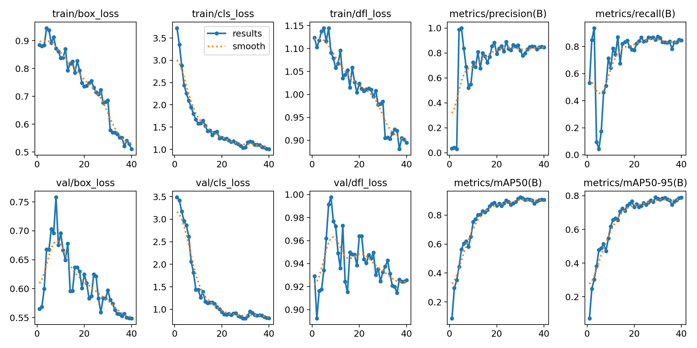

# YOLO Object Detection Project using Google Colab

## Dataset Setup
- Created my own dataset from scratch, consisting of **226 images** of various stationary objects.

### Annotation Tool
- **[HumanSignal] was used to manually label the bounding boxes
- Exported annotations were in YOLO format

### Data Split
- I used a script to split the dataset into training and validation sets:
- **90% (203 images) ** -> Training
- **10% (23 images) ** -> Validation

```bash
!python train_val_split.py --datapath="/content/custom_data" --train_pct=0.9
```
### Enviroment
- Goggle Colab with Tesla T4 GPU
- CUDA Version: 12.4
- Python Libraries:
    - 'ultralytics'


### **Training Configuration**
- Trial 1:
```bash
!yolo detect train \
    model = yolo11s.pt \
    epochs = 60 \
    imgsz = 640
```
- Trial 2:
```bash
!yolo detect train \
    model=yolo11n.pt \
    epochs=40 \
    imgsz=640
```

### open in Google Colab 
[![Open In Colab Trial 1]](https://colab.research.google.com/drive/1IY3cwbWdetpRWfH-Qe_h8FWRKmCRfORd?usp=sharing) 

[![Open In Colab Trial 2]](https://colab.research.google.com/drive/1hv9lqPSj9o3s8OWAjcXxYyzHyXtThxap?usp=sharing) 


### Sample Results
- Trial 1:




- Trial 2:


### Next steps
- Integrate real-time webcam inference locally using OpenCV
- Possibly deploy as a small demo app

### Notes
- I tested both YOLOv11s and YOLOv11n 
